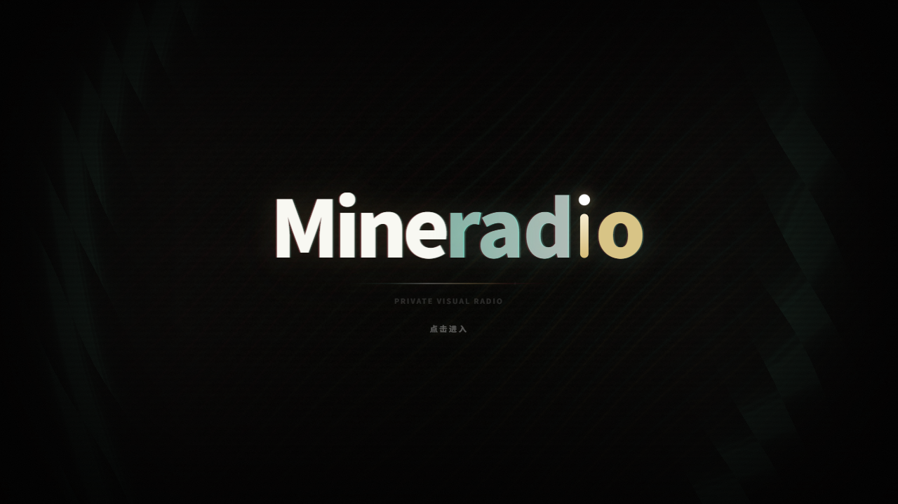

# LumaRadio

一台会呼吸的音乐播放器。

LumaRadio 是 Rocky 维护的 Web、PWA 与 macOS 沉浸式音乐播放器。它把搜索、播放队列、同步歌词、电影镜头、音频分析、粒子舞台和 3D 歌单架放进同一套界面，同时保持本地优先、单仓库和可复现构建。



## 特性

- 网易云音乐与 QQ 音乐搜索、登录和用户歌单
- 在线音乐、播客与本地音频统一队列
- LRC/YRC 歌词、自定义歌词与独立桌面歌词
- Three.js 粒子舞台、电影镜头、节拍分析和 3D 歌单架
- 可保存的视觉预设、封面、背景图片与背景视频
- 可安装 PWA、离线应用壳和网络状态降级
- macOS 原生交通灯、标准菜单、全局快捷键与桌面构建
- Web 与 macOS 共享同一套前端，不维护重复界面

## 快速开始

需要 Node.js 22.12 或更高版本。

```bash
npm install
npm run dev
```

浏览器打开 `http://127.0.0.1:3000`。开发服务器只绑定本机回环地址，API 服务运行在 `127.0.0.1:3001` 并由 Vite 代理。

运行生产 Web 版本：

```bash
npm run web
```

运行 macOS 桌面版：

```bash
npm start
```

## 工程结构

```text
index.html                  纯界面模板
src/
  main.ts                   应用入口与运行时装载
  core/                     API、存储与模块注册
  features/                 搜索、队列、认证领域逻辑
  engines/                  音频、歌词、粒子与场景算法
  platform/                 Web/PWA 宿主能力
  runtime/                  播放器视觉与交互模块
  styles/                   唯一共享视觉系统
public/                     图标、vendor 与静态资源
desktop/                    Electron 主进程与安全桥接
server.js                   本地音乐 API 与静态服务
tests/                      Vitest 单元测试
```

原先集中在一个约 1.35 MB、2.7 万行 HTML 里的界面、样式和运行时已经分离：HTML 只保留语义结构，视觉系统独立维护，播放器运行时按领域拆成 23 个 TypeScript 源文件；可复用的 API、搜索、队列、认证、歌词、音频和渲染逻辑拥有明确类型与 Vitest 覆盖。

Vite 负责 Web 开发与生产构建；TypeScript 分别编译应用模块、共享视觉运行时和 Service Worker；Electron 只承载同一份 `dist-web`，不会复制第二套 UI。

## 命令

| 命令 | 用途 |
| --- | --- |
| `npm run dev` | 启动 Vite、API 和 TypeScript watch |
| `npm run web` | 构建并运行生产 Web 服务 |
| `npm start` | 构建并运行 Electron |
| `npm test` | 运行 Vitest |
| `npm run typecheck` | 严格检查强类型模块 |
| `npm run build:web` | 生成 `dist-web` |
| `npm run build:mac:dir` | 生成可直接验收的 `.app` |
| `npm run build:mac` | 生成 universal DMG 与 ZIP |
| `npm run verify` | 类型、测试、构建、服务与安全回归 |

## 开发约束

- 不复制 Web/macOS 视觉代码；修改共享界面只进入 `index.html`、`src/styles` 或 `src/runtime`。
- API、音频、登录与用户数据只在本机处理。服务默认绑定 `127.0.0.1`。
- Service Worker 不缓存 `/api/` 和音频请求。
- macOS 使用原生交通灯与系统菜单，不渲染 Windows 风格窗口按钮。
- 视觉修改必须保留 SVG 玻璃纹理基线，并通过真实浏览器与播放回归。
- 不提交 Cookie、缓存、更新包、构建产物或用户媒体。

## 数据与第三方服务

登录 Cookie、节拍缓存和下载状态默认保存在 `~/.lumaradio`；浏览器偏好存放在本地存储。可通过 `LUMARADIO_DATA_DIR` 修改数据目录。

LumaRadio 不是网易云音乐、QQ 音乐或腾讯音乐娱乐集团的官方客户端。请只使用自己的账号与合法内容，并遵守对应服务条款、版权规则和会员权益。

## 贡献

提交改动前请运行：

```bash
npm run verify
npm run build:mac:dir
```

涉及视觉、播放或宿主行为的改动，还需要在真实 Chrome 和 macOS 应用中验证。Pull Request 应保持单一目的，描述用户影响、验证方式和截图；不要顺手重写电影视觉、粒子、歌词或 3D 歌单架。

## 许可证与致谢

LumaRadio 以 [GNU GPL v3.0](./LICENSE) 开源，修改与分发时必须继续提供对应源代码并保留必要版权声明。完整声明见 [NOTICE.md](./NOTICE.md)。

LumaRadio 由 Rocky 独立维护，基于 XxHuberrr 的 [Mineradio](https://github.com/XxHuberrr/Mineradio) 修改；原始程序、视觉设计与相关贡献仍归原作者及贡献者所有。
